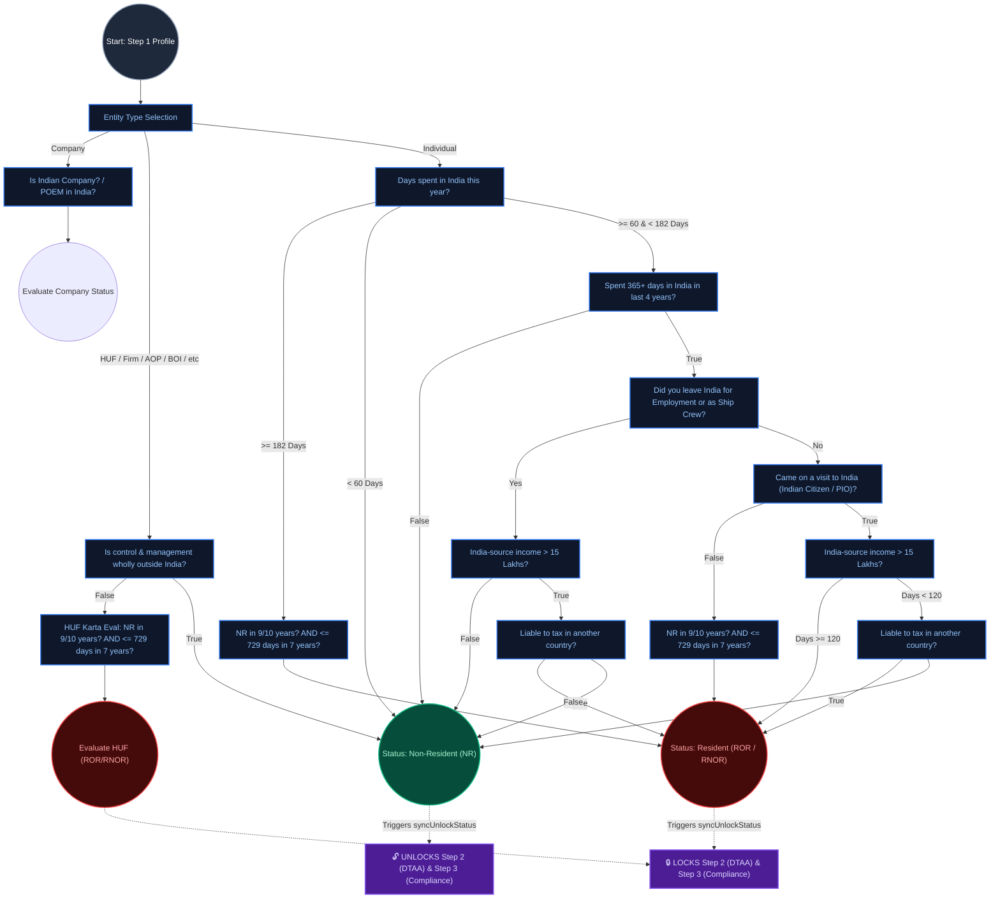

# Layer 1 India: Question Hierarchy & UI Flow

This document maps the exact question hierarchy, visibility dependencies, and Step unlock logic based on the original `layer1_india.html` specification. The new XState implementation (`layer1IndiaMachine.guards.ts` and `residencySolver.ts`) is designed to mirror this exact structure.

## Complete Questionnaire & UI Enablement Flow

The flowchart below demonstrates:
1. How non-individual entity types are handled.
2. The deep nested hierarchy of questions for Individuals (e.g., Employment -> Income -> Liable to Tax).
3. The exact condition that unlocks **Step 2 (DTAA)** and **Step 3 (Compliance)** in the frontend (which occurs when the evaluated status is `Non-Resident (NR)`).

### Hierarchy Breakdown

1. **Company & Other Entities:** The flow expands beyond Individuals. Selecting HUF, Firm, or AOP immediately changes the visible questions to Corporate/Entity-specific metrics (like POEM or "Wholly outside India").
2. **The 365 Days Anchor:** For Individuals in the `60 - 181` day range, the flow is completely gated by the `365+ days in last 4 years` question. If answered False, the user is immediately an NR and no further questions appear.
3. **The Employment Branch:** Only if `365+ days` is True does the Employment question (`Did you leave India for Employment or as Ship Crew?`) appear below it. The answer to this determines whether the user goes down the Income branch or the Visitor branch.
4. **DTAA / Compliance Enablement:** As seen in the `layer1_india.html` DOM logic, calculating a final status of `NR` is the explicit trigger that unlocks the DTAA (Step 2) and Compliance (Step 3) sidebar steps. If the days slider goes to `>= 182`, the status becomes Resident, and those steps are immediately locked. 

Both the legacy `layer1_india.html` and the modern XState architecture use this exact dependency tree to toggle UI visibility.
