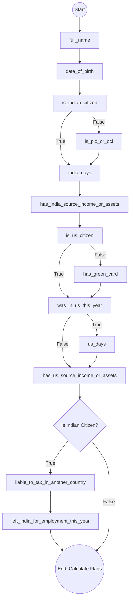
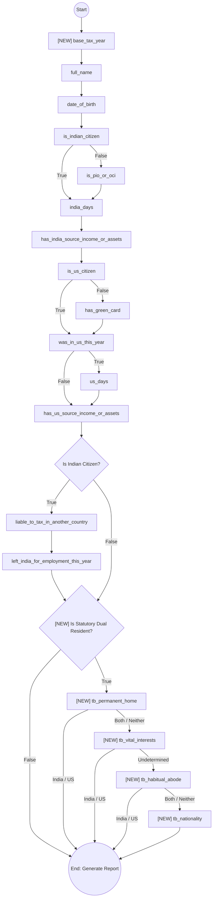

# Jurisdiction Router Flow Comparison

Below is the architectural state flow comparison between the original DOM-based logic (`router.html`) and the new XState v5 Machine (`routerMachine.ts`). The charts illustrate how user inputs affect the trajectory of questions.

## 1. Original Flow (`router.html`)
The original flow was a straightforward, linear sequence of 13 questions with basic show/hide gating conditions. It ended abruptly after `left_india_for_employment_this_year`.

 

## 2. Phase 1 Router Machine (`routerMachine.ts`)
The new XState machine introduces several critical logic upgrades. It adds `base_tax_year` at the very beginning, and most importantly, it injects the **Tie-Breaker Rule Waterfall** dynamically if the user is evaluated as a Statutory Dual Resident.

### Key Differences Observed:
1. **Initial Tax Year Question:** The machine prepends `base_tax_year` to anchor the subsequent residence tests.
2. **Dynamic Residency Evaluation:** `isStatutoryDualResident(ctx)` is evaluated *during* the flow (after basic jurisdiction inputs are collected).
3. **Tie-Breaker Waterfall:** If dual residency is detected, the flow conditionally branches into up to 4 DTAA tie-breaker tests (`permanent_home` -> `vital_interests` -> `habitual_abode` -> `nationality`). They short-circuit directly to the report as soon as a definitive tie-breaker winner is established.
